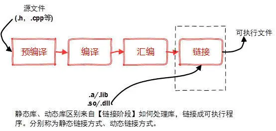

## C++ 编译过程

**介绍**：C++ 是编译型语言需，通过编译器（compiler）将源代码编译成机器码，之后才能执行的语言。一般需经过编译（compile）、链接（linker）这两个步骤。


### [零. 语言类型](#)

语言可以按照是否需要编译分为编译型、解释型、混合型三种，还可以按照**是否由严格的类型检查**分为动态语言和静态语言。

#### [0.0 编译型语言](#)

编译型语言是一种需要经过编译器将源代码转换为机器码（二进制代码）的程序设计语言。在运行之前，编译器会将源代码翻译成机器能够直接执行的指令，生成可执行文件。

* 编译是把源代码编译成机器码
* 链接是把各个模块的机器码和依赖库串连起来生成可执行文件。

**优点**：编译器一般会有预编译的过程对代码进行优化。因为编译只做一次，运行时不需要编译，所以编译型语言的程序执行效率高。可以脱离语言环境独立运行。

**缺点**：编译之后如果需要修改就需要整个模块重新编译。编译的时候根据对应的运行环境生成机器码，不同的操作系统之间移植就会有问题，需要根据运行的操作系统环境编译不同的可执行文件。

#### [0.1 解释型语言](#)

解释性语言的程序不需要编译，相比编译型语言省了道工序，解释性语言在运行程序的时候才逐行翻译。

**优点**：有良好的平台兼容性，在任何环境中都可以运行，前提是安装了解释器（虚拟机）。灵活，修改代码的时候直接修改就可以，可以快速部署，不用停机维护。

**缺点**：每次运行的时候都要解释一遍，性能上不如编译型语言。

#### [0.2 混合型语言](#)

既然编译型和解释型各有缺点就会有人想到把两种类型整合起来，取其精华去其糟粕。就出现了**半编译型语言**。比如C#, **C#在编译的时候不是直接编译成机器码而是中间码**，`.NET`平台提供了中间语言运行库运行中间码，中间语言运行库类似于Java虚拟机。`.NET`在编译成IL代码后，保存在dll中，首次运行时由JIT在编译成机器码缓存在内存中，下次直接执行（博友回复指出）。

我个人认为抛开一切的偏见 `C#`是这个星球上最好的编程语言。可惜微软的政策限制了C#的推广，**严格来说混合型语言属于解释型语言。C#更接近编译型语言**。

Java 先生成字节码再在 `Java` 虚拟机中解释执行。

#### [0.3 动态语言和静态语言](#)

动态语言是一类在运行时可以改变其结构的语言，与动态语言相对应的，运行时结构不可变的语言就是静态语言。

**动态类型语言**和**动态语言**是完全不同的两个概念。动态类型语言是指在运行期间才去做数据类型检查的语言，说的是数据类型，动态语言说的是运行是改变结构，说的是代码结构。

**1、动态语言**

是一类在运行时可以改变其结构的语言：例如新的函数、对象、甚至代码可以被引进，已有的函数可以被删除或是其他结构上的变化。通俗点说就是在运行时代码可以根据某些条件改变自身结构。

主要动态语言：Object-C、C#、JavaScript、PHP、Python、Erlang。

**2、静态语言**

与动态语言相对应的，运行时结构不可变的语言就是静态语言。如Java、C、C++。

* 很多人认为解释型语言都是动态语言，这个观点是错的！**Java是解释型语言但是不是动态语言**，**Java不能在运行的时候改变自己结构**。
* 动态语言都是解释型语言。也是错的！**Object-C是编译型语言，但是他是动态语言**。得益于特有的runtime机制（准确说run time不是语法特性是运行时环境，这里不展开）OC代码是可以在运行的时候插入、替换方法的。
* C#也是动态语言，通过C#的反射机制可以动态的插入一段代码执行。**所以我说C#是这个星球最好的编程语言**。

#### [0.4 动态类型语言](#)

很多网上资料把动态类型语言和动态语言混为一谈，简直是误人子弟。动态类型语言和动态语言是完全不同的两个概念。动态类型语言是指在运行期间才去做数据类型检查的语言，说的是数据类型，动态语言说的是运行是改变结构，说的是代码结构。

**动态类型语言的数据类型不是在编译阶段决定的，而是把类型绑定延后到了运行阶段**。

主要语言：Python、Ruby、Erlang、JavaScript、swift、PHP、Perl。

#### [0.5 静态类型语言](#)

静态语言的数据类型是在编译其间确定的或者说运行之前确定的，编写代码的时候要明确确定变量的数据类型。

主要语言：C、C++、C#、Java、Object-C。

#### [0.6 弱类型语言](#)

数据类型可以被忽略，一个变量可以赋不同数据类型的值。一旦给一个整型变量a赋一个字符串值，那么a就变成字符类型。

主要语言：JavaScript、PHP、C、C++（C和C++有争议，但是确实可以给一个字符变量赋整形值，可能初衷是强类型，形态上接近弱类型）

#### [0.7 注意](#)

* 解释型语言可以动态类型语言，编译型语言都是静态类型语言，这个也是错的。
* **swift是编译型语言但是它也是动态类型语言。C#和Java是解释型语言也是静态类型语言**。
* 一个语言是不是强类型语言和是不是动态类型语言也没有必然联系。Python是动态类型语言，是强类型语言。JavaScript是动态类型语言，是弱类型语言。Java是静态类型语言，是强类型语言。

### [一. C++ 语言翻译过程](#)

C++程序翻译主要分为四个过程：**预处理**、**编译**、**汇编**、**链接**。以linux系统下的g++编译器的翻译过程为例：


**1. 预处理** 在预处理中，程序会执行 “头文件展开、去注释、宏替换、条件编译”  等工作。

```shell
# -E 选项指示编译器仅对输入文件进行预处理
g++ -E test.cpp -o test.i
```

**2. 编译** 编译简单来讲，就是将预处理过后的“纯C++语言”转化成汇编语言。使用预处理的输出结果作为输入，**生成平台相关的汇编代码(assembly code)**。结果是文本格式，文件以.s结尾。

```shell
# -S 编译选项告诉 g++ 在为 C++ 代码产生了汇编语言文件后停止编译
# g++ 产生的汇编语言文件的缺省扩展名是 .s
g++ -S test.i -o test.s
```

**3. 汇编-Assembling**, 我们要知道，汇编语言并不是最原生的语言，在计算机底层，是以0,1信号来执行的。而汇编这一步，就是将汇编语言转成二进制机器语言，将汇编文件转换成二进制目标文件，最终生成`.o`文件

```shell
# -c 选项告诉 g++ 仅把源代码编译为机器语言的目标代码
# 缺省时 g++ 建立的目标代码文件有一个 .o 的扩展名。
g++ -c test.s -o test.o
```

**4. 链接-Linking** 生成可执行文件，虽然此时我们已经有了二进制目标文件，但该文件我们此时依然无法执行。因为虽然我们写了这份代码，但代码中调用的c++标准库中的函数还没有实现。而链接就是将我们写好的代码与c++标准库中对应的代码合起来，使得我们调用的函数可用。

```shell
# -o 编译选项来为将产生的可执行文件用指定的文件名
g++ test.o -o test
```

#### [1.1 C++ 分别编译](#)
通常，在一个 C++ 程序中，只包含两类文件—— .cpp 文件和 .h 文件。其中，.cpp 文件被称作 C++ 源文件，里面放的都是 C++ 的源代码；而 .h 文件则被称作 C++ 头文件，里面放的也是 C++ 的源代码。

C++ 语言支持 **"分别编译"（separatecompilation）** 。也就是说，一个程序所有的内容，可以分成不同的部分分别放在不同的 `.cpp` 文件里。`.cpp` 文件里的东西都是相对独立的，在编译（compile）时不需要与其他文件互通，只需要在编译成目标文件后再与其他的目标文件做一次链接（link）就行了。

比如，在文件 a.cpp 中定义了一个全局函数 `void a(){}`，而在文件 b.cpp 中需要调用这个函数。即使这样，文件 a.cpp 和文件 b.cpp 并不需要相互知道对方的存在，而是可以分别地对它们进行编译，编译成目标文件之后再链接，整个程序就可以运行了。

这是怎么实现的呢？从写程序的角度来讲，很简单。在文件 b.cpp 中，在调用 "void a()" 函数之前，先声明一下这个函数 `voida();`，就可以了。这是因为编译器在编译 b.cpp 的时候会生成一个**符号表（symbol table）**，像 `void a()` 这样的看不到定义的符号，就会被存放在这个表中。再进行链接的时候，编译器就会在别的目标文件中去寻找这个符号的定义。一旦找到了，程序也就可以顺利地生成了。

注意这里提到了两个概念，一个是**定义**，一个是**声明**。

简单地说，"定义"就是把一个符号完完整整地描述出来：它是变量还是函数，返回什么类型，需要什么参数等等。而"声明"则只是声明这个符号的存在，即告诉编译器，这个符号是在其他文件中定义的，我这里先用着，你链接的时候再到别的地方去找找看它到底是什么吧。

定义的时候要按 C++ 语法完整地定义一个符号（变量或者函数），而声明的时候就只需要写出这个符号的原型了。需要注意的是，一个符号，在整个程序中可以被声明多次，但却要且仅要被定义一次。试想，如果一个符号出现了两种不同的定义，编译器该听谁的？

这种机制给 C++ 程序员们带来了很多好处，同时也引出了一种编写程序的方法。考虑一下，如果有一个很常用的函数 `void f() {}`，在整个程序中的许多 .cpp 文件中都会被调用，那么，我们就只需要在一个文件中定义这个函数，而在其他的文件中声明这个函数就可以了。一个函数还好对付，声明起来也就一句话。但是，如果函数多了，比如是一大堆的数学函数，有好几百个，那怎么办？能保证每个程序员都可以完完全全地把所有函数的形式都准确地记下来并写出来吗？ 


#### [1.2 C++ 编译模式](#)
C++有以下几种编译模式：
* **Debug（调试）模式**：在这种模式下，编译器会生成用于调试的符号表，并且不进行优化。这使得程序在运行时可以方便地进行调试和跟踪。
* **Release（发布）模式**：在这种模式下，编译器会对代码进行优化，以提高执行效率。通常会关闭一些调试相关的选项，生成较小的可执行文件。
* **MinSizeRel（最小尺寸发布）模式**：这是一个更加优化的发布模式，旨在生成尽可能小的可执行文件。在这种模式下，编译器会更进一步地优化代码，并且可能会牺牲一些执行速度以获得更小的尺寸。
* **RelWithDebInfo（带调试信息的发布）模式**：这是一个结合了发布和调试信息的模式。它会生成优化后的代码，并且保留符号表和调试信息，以便在需要时进行调试。

这些编译模式可以根据项目需求和开发目标进行选择，并且可以在构建系统中进行配置。每种模式都有其适用的场景和权衡，开发者可以根据具体情况选择最合适的编译模式。

#### [1.3 C++ 头文件作用](#)

就 C++ 的基础而言，头文件通常用于声明某些类型的函数，以便它们能够被使用在你的程序中，如果你回想一下 C++ 编译器和链接器那两讲，里面涉及到了我们需要某些声明存在，以便我们知道它们的功能和类型是否可供我们使用。

* `.h` 头文件中，只能存在变量或者函数的**声明**，而**不要放定义**。
### [2. 编译器](#)
C++编译器有msvc，gcc/g++, clang/clang++. intel c++！它们运行在不同的平台，有着不同的命令脚本、构建工具！
* msvc编译工具链几乎不需要写编译脚本，可以通过GUI完成操作。
* make作为构建工具,make使用makefile作为编译脚本。
* ninja也有自己的编译脚本。
* `...`

他们形态各异，语法各不相同，还有着平台差异，linux、windows、macos。 而cmake提供了更高一层的抽象，你不再需要去了解
makefile、ninja脚本，clang使用、怎么迁移到msvc，你只需要关注CMakeLists.txt脚本即可，底层细节由cmake来帮你处理。

### [3. 动态库与静态库](#)
库是写好的现有的、成熟的、可以复用的代码。现实中每个程序都要依赖很多基础的底层库，不可能每个人的代码都从零开始，因此库的存在意义非同寻常。

本质上来说库是一种可执行代码的二进制形式，可以被操作系统载入内存执行。

库有两种：**静态库（.a、.lib）**和**动态库（.so、.dll）**。 




首选要区分动态链接和静态链接！

**静态链接**: 就是在装载之前，就完成所有的符号引用的一种链接方式。程序的开发与发布流程受模块制约， 只要有一个模块更新，那么就需要重新编译打包整个代码。
* **优点**：静态链接的优点在于程序**运行不会受库的影响**, **直接把库的源代码和自己的源代码合在一起成为一个可执行文件！**
* **缺点**：静态链接实现的方法就是要**将程序需要的资源放到程序中**，同时程序内部解决一个需要调用库里面的代码的问题时，需要拷贝一份内部的解决方法到对应的位置，这就会不可避免的导致程序存储占用增加。并且程序在运行时需要加载到内存里，**程序体积大就会导致加载时间长**。

**动态链接**： 基本思想就是将对符号的重定位推迟到程序运行时才进行。
* **优点**：动态链接是从库里面找方法，这就意味着程序本身并不包含库，**也就说明动态链接的程序存储占用会比较小**。在加载到内存时体积小的程序也会比较快。
* **缺点**：动态链接需要到库里面去寻找方法，这就导致如果库因为某些原因无法使用，比如上文中说的食堂需要装修就好比是库需要更新换代了，此时程序就无法运行了。虽然更新后也许会更好用，但在更新时我们是无法使用的。


#### [3.1 C++ 静态连接](#)
Linux静态库命名规范，必须是 **lib[your_library_name].a**，**lib**为前缀，中间是静态库名，扩展名为 **.a**。

Linux下使用ar工具、Windows下vs使用lib.exe，将目标文件压缩到一起，并且对其进行编号和索引，以便于查找和检索。

**创建静态库（.a）**
```shell
g++ -c Swap.cpp -o Swap.o
```
生成静态库libSwap.a
```shell
ar rs libSwap.a Swap.o
```
大一点的项目会编写makefile文件（CMake等等工程管理工具）来生成静态库，输入多个命令太麻烦了。

使用静态库!
```shell
g++ main.cpp -Lsrc -lSwap -o staticMain
```
* **-L**：表示要连接的库所在目录
* **-l**：指定链接时需要的动态库，编译器查找动态连接库时有隐含的命名规则，即在给出的名字前面加上lib，后面加上 **.a** 或 **.so** 来确定库的名称。
#### [3.2 C++ 动态连接](#)
动态链接库的名字形式为 **libxxx.so**，前缀是 **lib**，后缀名为 **.so**。

创建静态库不同的是，不需要打包工具（ar、lib.exe），直接使用编译器即可创建动态库。

首先，生成目标文件，此时要加编译器选项-fpic，-fPIC 创建与地址无关的编译程序（pic，position independent code），是为了能够在多个应用程序间共享。

```shell
g++ Swap.cpp -I../include -fPIC -shared -o libSwap.so
```
链接，生成可执行文件:sharemain
```shell
g++ main.cpp -Iinclude -Lsrc -lSwap -o dynamicMain
```

----
[cmake: https://cmake.org/](https://cmake.org/)